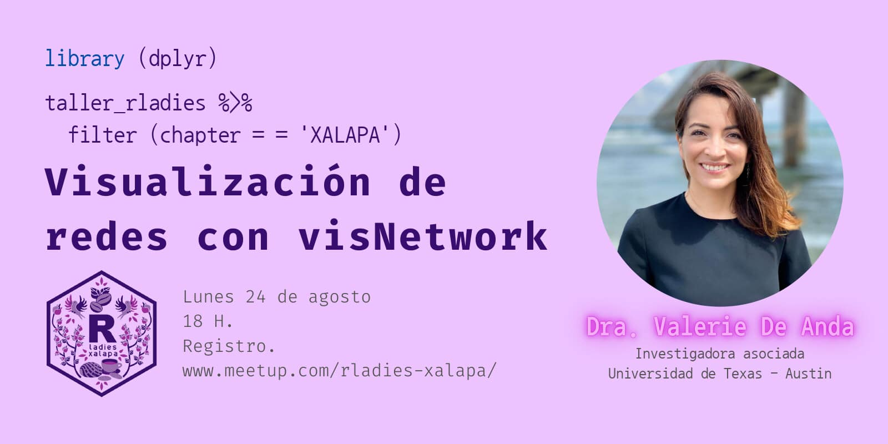
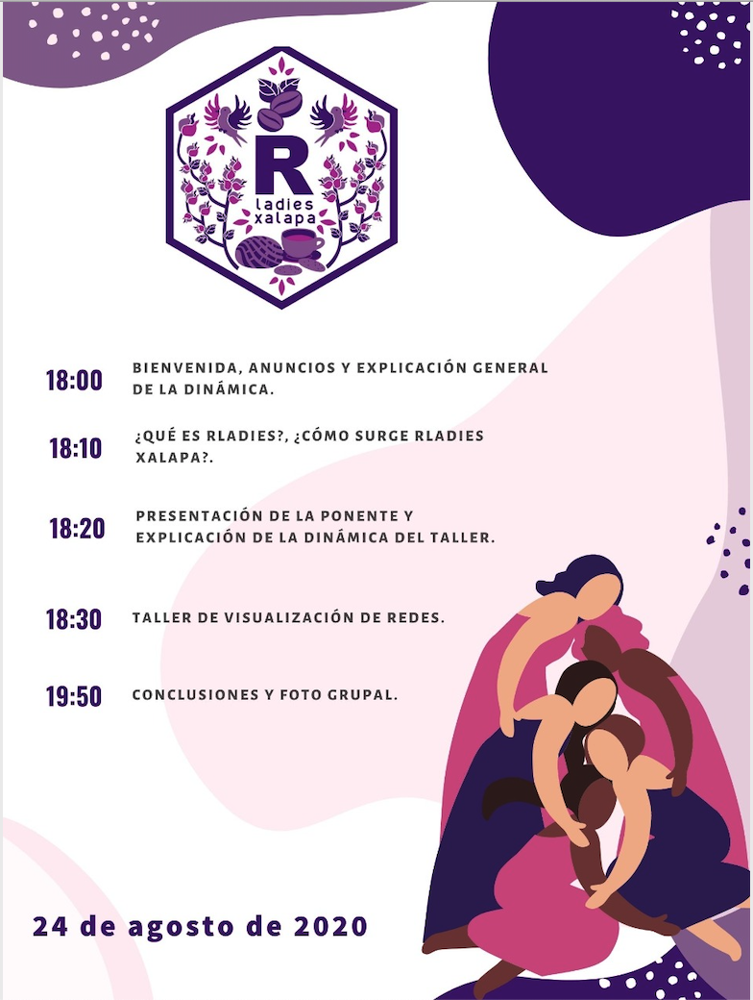
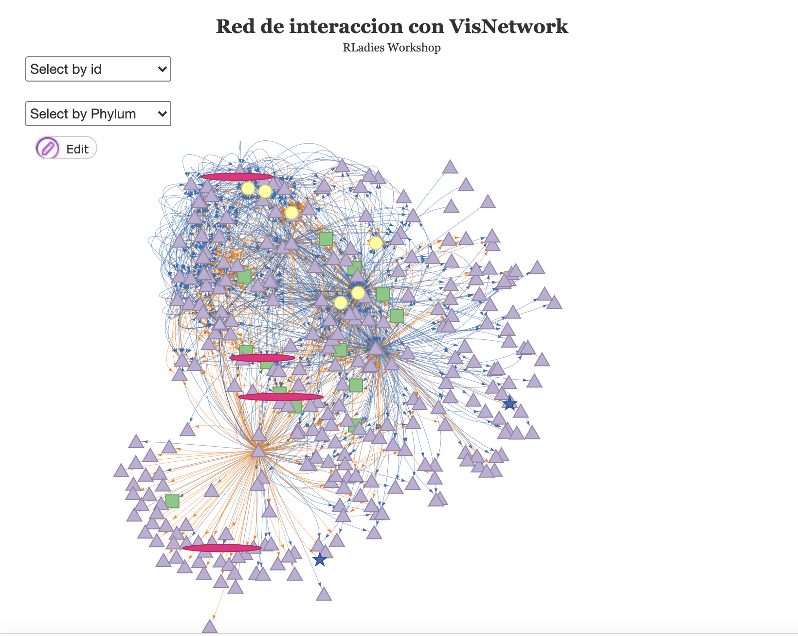

# Rladies





# Taller de visualización de redes complejas con VisNetwork

## Acerca de los datos

En este taller aprenderemos a utilizar la libreria de R [VisNetwork](https://datastorm-open.github.io/visNetwork/) que permite la visualización interactiva de redes. 

Utilizaremos datos reales descritos en [De Anda et al., 2018](https://www.frontiersin.org/article/10.3389/fmicb.2018.02606/full). Específicamente, la red biológica se obtuvo al caracterizar tapetes microbianos muestreados en el tiempo durante y después de una perturbación antropogénica causada por la extracción masiva de agua profunda en Cuatro Ciénegas Coahuila México.  Si quieres más información visita la pagina del [Documental de Cuatro Ciénegas](https://documentalcuatrocienegas.com/) o la revisión del análisis de redes en perspectiva de la problematica de extracción de agua en Cuatro Cienégas [De Anda et al., 2018](https://link.springer.com/chapter/10.1007/978-3-319-95855-2_7). 

Los datos de este ejercicio forman parte de los archivos ejemplo de [NetAn](https://github.com/valdeanda/NetAn), un algorítmo diseñado para analizar las caracteriticas topologicas de redes complejas. 

Las redes biólogicas se predijeron utlizando [Lotka-Volterra model based tool, the Metagenomic Microbial Interacticon Simulator (MetaMIS)](https://bmcbioinformatics.biomedcentral.com/articles/10.1186/s12859-016-1359-0. 

## Descripción de los datos

El archivo edges2addTax.tab contiene la lista de adyacencia derivada de las red consenso obtenida con MetaMIS. 
Este archivo lo vamos a modificar para agregarle un color específico a las interacciones negativas  y positivas (azul y naranja respectivamente). 


```
from    to      Strength
Actinobacteria unclassified_class_1760  Unclassified Gammaproteobacteria unclassified   -5.93E+14
Actinobacteria unclassified_class_1760  Bacillaceae     -5.76E+14
Actinobacteria unclassified_class_1760  Francisellaceae -5.75E+14
Actinobacteria unclassified_class_1760  Leotiomyceta unclassified       -5.34E+14
Actinobacteria unclassified_class_1760  Nitriliruptoraceae      -4.81E+14
Actinobacteria unclassified_class_1760  Ardenticatenaceae       -4.68E+14
Actinobacteria unclassified_class_1760  Verrucomicrobiales unclassified -4.61E+14
Actinobacteria unclassified_class_1760  Microchaetaceae -4.51E+14
Actinobacteria unclassified_class_1760  Competibacteraceae      -4.49E+14
```

El archivo nodes2addColors.tab es una descripción de todos los taxa identificados con su correspondiente asignación taxonómica 
En R vamos a agregar un color y una forma geométrica especifica a cada nodo. Visita la pagina de [VisNetwork](https://datastorm-open.github.io/visNetwork/nodes.html) e para  saber más sobre las opciones de formas geometricas predeterminadas en la libreria. 

```
id      Group   Domain  Phylum  Class
Candidatus Bathyarchaeota unclassified  1       Archaea Candidatus Bathyarchaeota       Candidatus Bathyarchaeota unclassified
Candidatus Diapherotrites unclassified  1       Archaea Candidatus Diapherotrites       Candidatus Diapherotrites unclassified
Crenarchaeota unclassified      1       Archaea Crenarchaeota   Crenarchaeota unclassified
Euryarchaeota unclassified      1       Archaea Euryarchaeota   Euryarchaeota unclassified
Archaea unclassified    1       Archaea Archaea_unclassified    Archaea_unclassified
Nanoarchaeota unclassified      1       Archaea Nanoarchaeota   Archaea_unclassified
TACK group unclassified 1       Archaea Archaea_unclassified    Archaea_unclassified
Thaumarchaeota unclassified     1       Archaea Thaumarchaeota  Archaea_unclassified
Unclassified Archaea unclassified       1       Archaea Archaea_unclassified    Archaea_unclassified
```

## Red esperada




## Visualizacion con VisNetwork

**[Link al ejercicio ](https://valdeanda.github.io/Rladies/script/VisNetwork.html)**

---

## Referencias 

### Introducción a las redes

* [Lenguage Wolfram introducción a redes](https://www.wolfram.com/language/elementary-introduction/2nd-ed/21-graphs-and-networks.html.es)
* [Aldana 2011:Redes Complejas: Estructura, Dinámica y Evolución](https://www.fis.unam.mx/~max/MyWebPage/notastwocolumn.pdf)


### Redes complejas
* [Barabási & Albert 1999](https://science.sciencemag.org/content/286/5439/509)
* [Watts & Strogatz 1998](https://www.nature.com/articles/30918)
* [Albert R & Barabási 2002](https://journals.aps.org/rmp/abstract/10.1103/RevModPhys.74.47)
* [Tëmkin I., Eldredge N. (2015)](https://link.springer.com/chapter/10.1007/978-3-319-15045-1_6)
* [Torres Agudo 2020](http://www.ugr.es/~jtorres/Tema_2_redes_complejas.pdf)
New insights into how to utilize graph theoretical measures to make neurobiological inferences regarding the mechanisms underlying human cognition, behavior, and brain disorders. 
* [Farahani et al., 2019](https://www.frontiersin.org/articles/10.3389/fnins.2019.00585/full)

### Network motifs

* [Milo et al., 2002](https://science.sciencemag.org/content/298/5594/824)
* [Bascompte J 2009](https://science.sciencemag.org/content/325/5939/416/F2)
* [Shen et al., 2002](https://www.nature.com/articles/ng881z)
* [Prill et al., 2005](https://journals.plos.org/plosbiology/article?id=10.1371/journal.pbio.0030343)
* [Tran et al., 2013](https://www.nature.com/articles/ncomms3241)


### Protein-Protein Interactions
* [EBI-Training online course](https://www.ebi.ac.uk/training/online/course/network-analysis-protein-interaction-data-introduction/protein-protein-interaction-networks)

### Modularity in Networks

* [Newman 2006](https://www.pnas.org/content/103/23/8577)

### Ejemplos de redes genéticas 

* [Chen et al., 2018](https://www.nature.com/articles/s41467-018-06772-3)

### Redes ecológicas 

* [Proulx et al., 2005](https://www.sciencedirect.com/science/article/abs/pii/S0169534705000881)
* [Delmas et al., 2018](https://onlinelibrary.wiley.com/doi/10.1111/brv.12433)

### Redes ecologicas en comunidades microbianas

* [Faust & Raes 2012 Review](https://www.nature.com/articles/nrmicro2832)
* [Xiao et al., 2017](https://www.nature.com/articles/s41467-017-02090-2.pdf?proof=true)
* [De Anda et al., 2018](https://www.frontiersin.org/articles/10.3389/fmicb.2018.02606/full)
* [De Anda et al., 2018](https://link.springer.com/chapter/10.1007/978-3-319-95855-2_7)

### Herramientas para predecir redes de comunidades microbianas a partir de datos de secuenciación masiva

* [CoNet](http://systemsbiology.vub.ac.be/conet)
* [Cytoscape](http://apps.cytoscape.org/apps/conet)
* [SPIEC-EASI](https://github.com/zdk123/SpiecEasi)
* [FlashWeave](https://github.com/meringlab/FlashWeave.jl)
* [Tutorial using SparCC with 16S derived data](https://rachaellappan.github.io/16S-analysis/correlation-between-otus-with-sparcc.html)
* [SparCC]
(https://journals.plos.org/ploscompbiol/article?id=10.1371/journal.pcbi.1002687)
* [MENAP](https://bmcbioinformatics.biomedcentral.com/articles/10.1186/1471-2105-13-113)
* [REBACCA](https://pubmed.ncbi.nlm.nih.gov/26079350/)
* [Mint](https://link.springer.com/chapter/10.1007/978-3-319-16706-0_6)
* [gCoda](https://www.liebertpub.com/doi/abs/10.1089/cmb.2017.0054?journalCode=cmb)

### Redes en  Series de tiempo 

* [Xia et al., 2013](https://academic.oup.com/bioinformatics/article/29/2/230/202138)
* [Durno et al., 2013](https://bmcgenomics.biomedcentral.com/articles/10.1186/1471-2164-14-S1-S3)
* [xIA ET AL., 2011](https://bmcsystbiol.biomedcentral.com/articles/10.1186/1752-0509-5-S2-S15)
* [eLSA](https://bitbucket.org/charade/elsa/wiki/Home)

#### Series de tiempo en linea de comandos 

* [fastLSA](http://hallam.microbiology.ubc.ca/fastLSA/install/index.html)
* [eLSA](https://bitbucket.org/charade/elsa/wiki/Home)


### Series de tiempo con Generalized Lotka-Volterra (gLV)

* [Limits](https://journals.plos.org/plosone/article?id=10.1371/journal.pone.0102451)
* [MDSINE](https://genomebiology.biomedcentral.com/articles/10.1186/s13059-016-0980-6)
* [METAMIS](https://bmcbioinformatics.biomedcentral.com/articles/10.1186/s12859-016-1359-0)
* [Alshawagfeh et al., 2017](https://bmcgenomics.biomedcentral.com/articles/10.1186/s12864-017-3605-x)
* [Faust et al., 2015](https://www.sciencedirect.com/science/article/pii/S1369527415000478)

### Analisis topologicos de redes

* [Anuran](https://github.com/ramellose/anuran)
* [NetAn](https://github.com/valdeanda/NetAn)

### Visualización de redes

* [Graphviz](https://link.springer.com/chapter/10.1007/3-540-45848-4_57)
* [Gephi](https://gephi.org/publications/gephi-bastian-feb09.pdf)
* [CellNetVis](https://europepmc.org/article/med/28929969)
* [Tulip](https://tulip.labri.fr/TulipDrupal/)
* [Cystocape](https://cytoscape.org/)
* [PEx-Graph](http://vicg.icmc.usp.br/vicg/tool/1/projection-explorer-pex)
* [Biographer](https://www.ncbi.nlm.nih.gov/pmc/articles/PMC3661053/)
* [CerebralWeb](https://academic.oup.com/database/article/doi/10.1093/database/bav041/2433173)
* [Cell illustrator](http://ebooks.iospress.nl/publication/13959)


## Herramientas 
